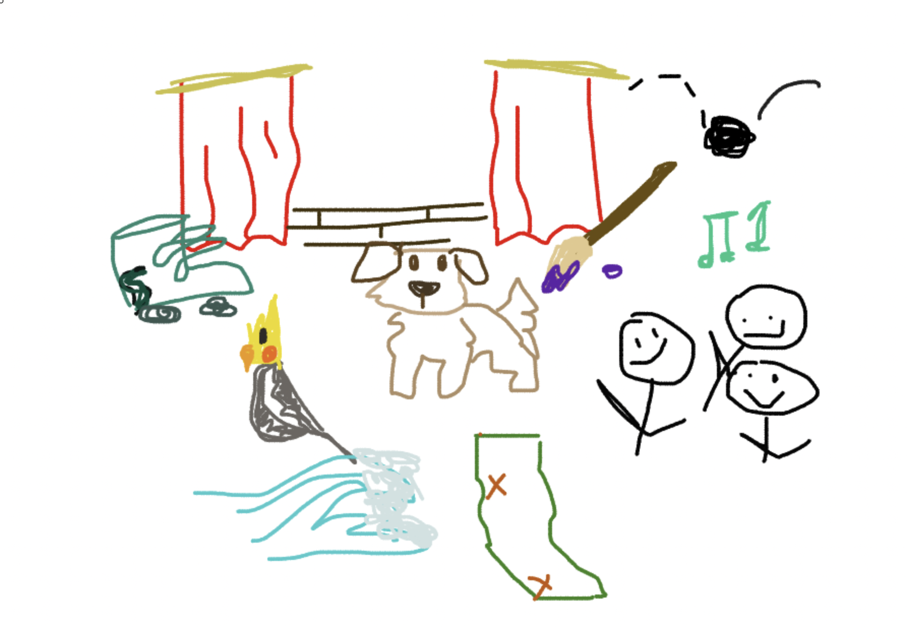

 
ft the iconic frog: 

  

## Work Done by Week:
### Tri 1:

 

<table class="tg" style="undefined;table-layout: fixed; width: 449px">
<colgroup>
<col style="width: 63px">
<col style="width: 386px">
</colgroup>
<thead>
  <tr>
    <th class="tg-mkpd">Week</th>
    <th class="tg-f15s">Tangibles</th>
  </tr>
</thead>
<tbody>
  <tr>
    <td class="tg-fymr">1</td>
    <td class="tg-0pky"></td>
  </tr>
  <tr>
    <td class="tg-fymr">2</td>
    <td class="tg-0pky"></td>
  </tr>
  <tr>
    <td class="tg-fymr">3</td>
    <td class="tg-0pky"></td>
  </tr>
  <tr>
    <td class="tg-fymr">4</td>
    <td class="tg-0pky"></td>
  </tr>
  <tr>
    <td class="tg-fymr">5</td>
    <td class="tg-0pky"></td>
  </tr>
  <tr>
    <td class="tg-fymr">6</td>
    <td class="tg-0pky"></td>
  </tr>
</tbody>
</table>

 
 

## Overview of Hacks, Study and Tangibles
Blogging in GitHub pages is a way to learn and code at the same time. 

- Plans, Lists, [Scrum Boards](https://clickup.com/blog/scrum-board/) help you to track key events, show progress and record time.  Effort is a big part of your class grade.  Show plans and time spent!
- [Hacks(Todo)](https://levelup.gitconnected.com/six-ultimate-daily-hacks-for-every-programmer-60f5f10feae) enable you to stay in focus with key requirements of the class.  Each Hack will produce Tangibles.
- Tangibles or [Tangible Artifacts](https://en.wikipedia.org/wiki/Artifact_(software_development)) are things you accumulate as a learner and coder. 
